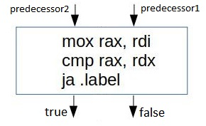

## Basic Block {#sec:BasicBlock}

A basic block is a sequence of instructions with a single entry and single exit. Figure @fig:BasicBlock shows a simple example of a basic block, where `MOV` instruction is an entry, and `JA` is an exit instruction. While basic block can have one or many predecessors and successors, no instruction in the middle can exit the block. 

{#fig:BasicBlock width=40% }

It is guaranteed that every instruction in the basic block will be executed exactly once. This is a very important property that is utilized by many compiler transformations. For example, it greatly reduces the problem of control flow graph analysis and transformations since, for some class of problems, we can treat all instructions in the basic block as one entity.
